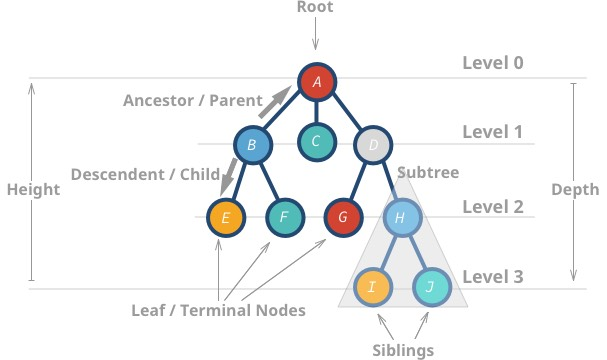

https://adrianmejia.com/data-structures-for-beginners-trees-binary-search-tree-tutorial/#Implementing-a-simple-tree-data-structure
https://www.freecodecamp.org/news/all-you-need-to-know-about-tree-data-structures-bceacb85490c/
আলোচ্যসুচীঃ

[1. Trees কি?](#1)

[2. Simple Tree Implementation?](#2)

[3. Binary Trees](#3)

4.Binary Trees vs Binary Search Trees

[5. BST Node insert করা](#5)

[6. BST traverse](#6)

[7. BST Node Delete করা এবং in-order এ পুনর্বিন্যাস করা](#7)

<a id="1"></a>

[1. Trees কি?]()
Tree তে cycle থাকে না এবং Tree এর নির্দিষ্ট root থাকে । Tree হল এক ধরণের Graph কিন্তু সকল Gpaph ই Tree নয় ।

Tree এর Height = root - farthest leaf(দুরতম leaf) । এক্ষেত্রে edge count করা হয়
A এর height = 3
I এর height = 0
কোন node এর Depth বা level = root - node
H এর depth = 2
B এর depth = 1

<a id="2"></a>

[2. Simple Tree Implementation?]()


```
class TreeNode {
    constructor(value) {
        this.value = value;
        this.descendants = [];
    }
}
//create nodes with values

const abc = new TreeNode("Abc");
const homer = new TreeNode("homer");
const bart = new TreeNode("bart");
const lisa = new TreeNode("Lisa");
const maggie = new TreeNode("maggie");
// associate node with it's descendants

abc.descendants.push(homer);
homer.descendants.push(bart, lisa, maggie);
// console.log(abc, null, 4);
console.dir(abc, { depth: null, colors: true, maxArrayLength: null });
```

<a id="3"></a>

[3. Binary Trees?]()
একটা Tree এর Node সংখ্যা শূন্য,এক, দুই বা ততোধিক হতে পারে । Node সংখ্যা সর্বচ্চ ২ টা হলে সেই Tree কে Binary Tree বলে ।
**Full binary tree:** each node has exactly 0 or 2 children (but never 1).
**Complete binary tree:** when all levels except the last one are full with nodes.
**Perfect binary tree:** when all the levels (including the last one) are full of nodes.


<a id="5"></a>

[5. BST Node insert করা]()
left<root<=right

```
class createNode {
    constructor(value) {
        this.value = value;
        this.left = null;
        this.right = null;
    }
}

class BinarySearchTree {
    constructor() {
        this.root = null;
    }
    insert(value) {
        let newNode = new createNode(value)
        if (this.root !== null) {
            this.insertNode(this.root, newNode)
        } else {
            this.root = newNode
        }
    }
    insertNode(node, newNode) {
        if (newNode.value < node.value) {
            //left node
            if (node.left === null) {
                node.left = newNode
            } else {
                this.insertNode(node.left, newNode)
            }
        } else {
            //right node
            if (node.right === null) {
                node.right = newNode
            } else {
                this.insertNode(node.right, newNode)
            }
        }
    }
}

const BST = new BinarySearchTree();
BST.insert(25);
BST.insert(20);
BST.insert(36);
BST.insert(10);
BST.insert(22);
BST.insert(30);
BST.insert(40);
BST.insert(77);
console.dir(BST, { depth: null, colors: true, maxArrayLength: null })
```

<a id="6"></a>

[6. BST traverse]()
**Tree Traversal Algorithms দুই ধরনের:**

1. DFS =>৩ প্রকারঃ

- In-order
- pre-order
- post-order

2. BFS => 1 প্রকারঃ

- Level Order Traversal

```
//DFS
function createNode(value) {
    return {
        value: value,
        left: null,
        right: null
    }
}

class BinarySearchTree {
    constructor() {
        this.root = null;
    }
    insert(value) {
        const newNode = createNode(value)
        if (this.root === null) {
            this.root = newNode
        } else {
            this.insertLeftOrRight(this.root, newNode);
        }
    }
    insertLeftOrRight(parent, newNode) {
        if (parent.value > newNode.value) {
            //left node
            if (parent.left === null) {
                parent.left = newNode
            } else {
                this.insertLeftOrRight(parent.left, newNode)
            }
        }
        else {
            //right node
            if (parent.right === null) {
                parent.right = newNode
            } else {
                this.insertLeftOrRight(parent.right, newNode);
            }
        }
    }
    //In-order traversal order: left, parent, right
    inOrder(root = this.root) {
        if (root === null) {
            return;
        }
        this.inOrder(root.left)
        process.stdout.write(root.value + ' ');
        this.inOrder(root.right)
    }
    //Post-order traversal order: left, right, parent
    postOrder(root = this.root) {
        if (root === null) {
            return;
        }
        this.postOrder(root.left)
        this.postOrder(root.right)
        process.stdout.write(root.value + ' ');

    }
    //pre-order traversal order: parent, left, right
    preOrder(root = this.root) {
        if (root === null) {
            return;
        }
        process.stdout.write(root.value + ' ');
        this.preOrder(root.left)
        this.preOrder(root.right)
    }
}
const BST = new BinarySearchTree()
BST.insert(25);
BST.insert(36);
BST.insert(20);
BST.insert(10);
BST.insert(22);
BST.insert(30);
BST.insert(40);

console.dir(BST, { depth: null, color: true, arrMaxLength: null })
process.stdout.write("In order: left->root->right : ");
BST.inOrder();
process.stdout.write("\nPost order: left->right->root: ");
BST.postOrder()
process.stdout.write("\nPre order: root->left->right: ");
BST.preOrder()
```

<a id="7"></a>

[7. BST Node Delete করা এবং in-order এ পুনর্বিন্যাস করা]()

```
//https://levelup.gitconnected.com/deletion-in-binary-search-tree-with-javascript-fded82e1791c
function createNode(value) {
    return {
        value: value,
        left: null,
        right: null
    }
}
class BinarySearchTree {
    constructor() {
        this.root = null
    }
    insert(value) {
        const newNode = createNode(value)
        if (this.root) {
            this.insertLeftOrRight(this.root, newNode)
            return
        }
        this.root = newNode
        return
    }
    insertLeftOrRight(currentNode, newNode) {
        if (newNode.value < currentNode.value) {
            //left chile
            if (currentNode.left === null) {
                currentNode.left = newNode
            }
            else {
                this.insertLeftOrRight(currentNode.left, newNode)
            }
        }
        else {
            //right child
            if (currentNode.right === null) {
                currentNode.right = newNode
            } else {
                this.insertLeftOrRight(currentNode.right, newNode);
            }
        }
    }
    remove(value) {
        this.removeNode(this.root, value)
    }
    removeNode(currentNode, value) {
        // base case, if the tree is empty
        if (currentNode === null) {
            return null
        }
        // when value is the same as current's value, this is the node to be deleted
        if (value === currentNode.value) {
            // for case 1 and 2, node without child or with one child
            if (currentNode.left === null && currentNode.right === null) {
                return null
            } else if (currentNode.left === null) {
                return currentNode.right
            } else if (currentNode.right === null) {
                return currentNode.left
            } else {
                // node with two children, get the inorder successor,
                //smallest in the right subtree
                let tmpNode = this.kthSmallestNode(currentNode.right);
                currentNode.value = tmpNode.value
                /// delete the inorder successor
                currentNode.right = this.removeNode(currentNode.right, tmpNode.value)
                return currentNode
            }
        }
        else if (value < currentNode.value) {
            currentNode.left = this.removeNode(currentNode.left, value)

            console.log("=========");
            console.log(currentNode);
            return currentNode
        } else {
            currentNode.right = this.removeNode(currentNode.right, value)
            return currentNode
        }
    }
    // helper function to find the smallest node
    kthSmallestNode(node) {
        while (!node.left === null) {
            node = node.left
        }
        return node
    }
}

const BST = new BinarySearchTree()
BST.insert(30)
BST.insert(10)
BST.insert(40)
BST.insert(35)
BST.insert(50)
BST.insert(15)
BST.insert(12)

BST.remove(40)
// BST.remove(10)

console.dir(BST, { depth: null, color: true, maxArraySize: null });
```
